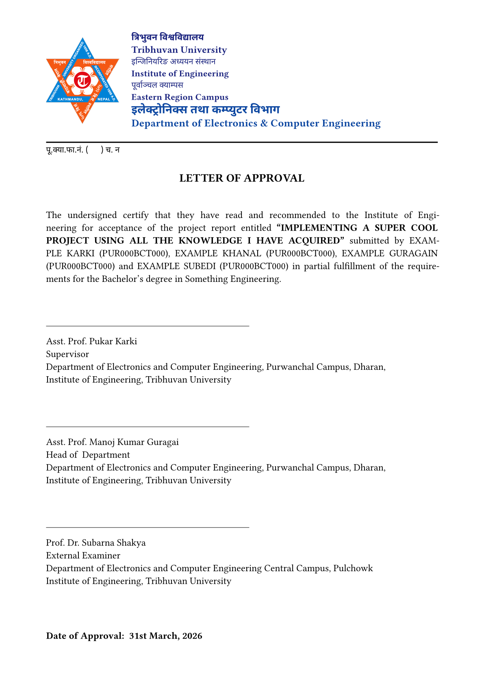

# IOE, TU Reports in Typst

A Typst template for making reports and related documents for students of IOE, TU.

## Prerequisites

Before using these templates, you need to install the following on your computer:
* Typst
* Times New Roman font
* Zathura PDF reader (recommended for continuous live updates)

## Templates Included

This repository contains templates for different use cases. Please refer to their respective guides for usage instructions:
* [Report Template](./report) - For standard project and academic reports
* [Letter of Approval Template](./letter-of-approval) - For official approval letters

| Cover Page | Title Page | LoA |
| :----: | :----: | :----: |
|  |  |  | 
