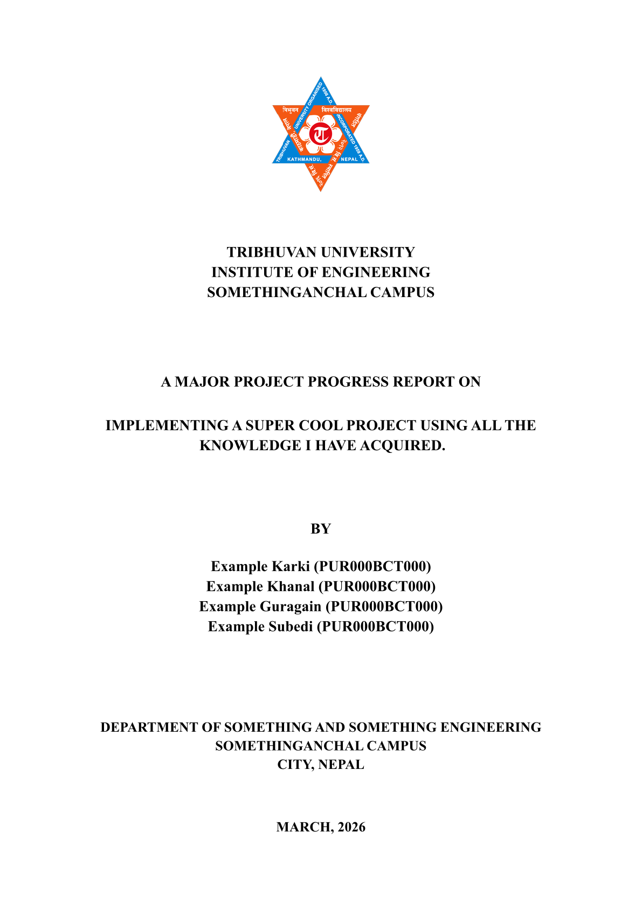
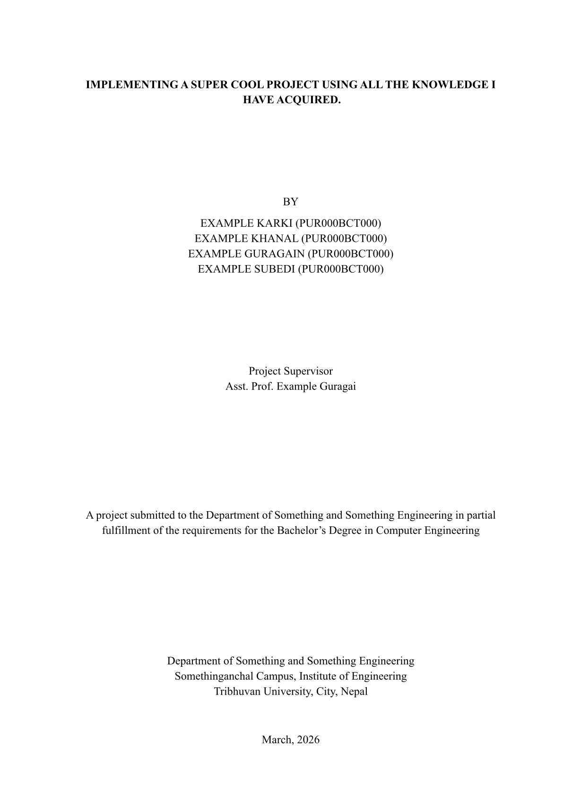

# Report Template

This template is designed for standard academic and project reports at IOE, TU.

## Usage Instructions

* Check that Typst and the Times New Roman font are installed on your computer.
* Open the `main.typ` file to configure your report's information (like title, author, and date).
* Add your content within the `content` directory, structuring your chapters and sections as needed limit to files like `intro.typ` or `methodology.typ`.
* Use the provided styling and components defined in the `lib` directory for consistent formatting.
* Update the imported files in the `main.typ` to include the chapters you've written.
* Run `typst watch main.typ` in your terminal to continuously compile the document as you make changes.
* Open the generated PDF in Zathura for automatic, continuous updates.

## Configuration Settings

The `main.typ` file begins with a `#show: project.with(...)` block. This is where you configure the core information of your report.

* **`campus`**: Name of the college/campus.
* **`type`**: The subtitle or nature of the report (e.g., Progress Report, Final Report).
* **`title`**: The main heading of your project.
* **`by`**: A list of students who authored the document, alongside their roll numbers.
* **`supervisor`**: The name and title of your guiding teacher.
* **`department`**: The department you belong to.
* **`faculty`**: The broader engineering discipline (e.g., Computer, Civil).
* **`address`**: Location of your campus.
* **`date`**: Submission date shown on the title pages.
* **`show-coverpage` & `show-titlepage`**: Set these to `true` or `false` depending on whether you want these pages generated in your final document.

|        |        |
| :----: | :----: |
|  |  |
